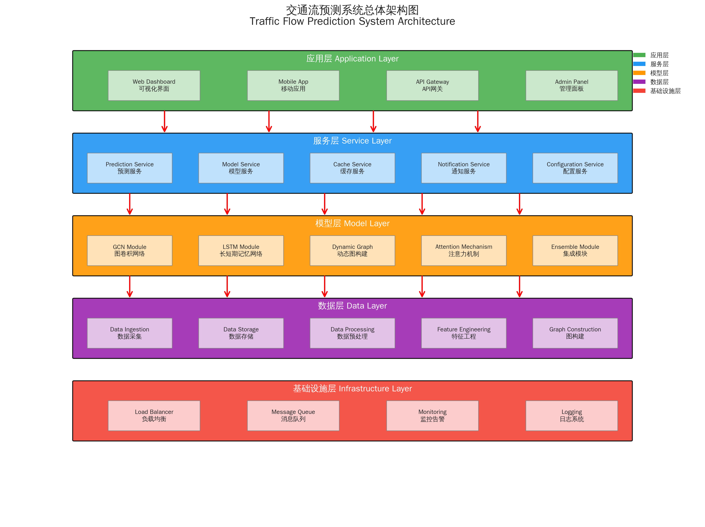
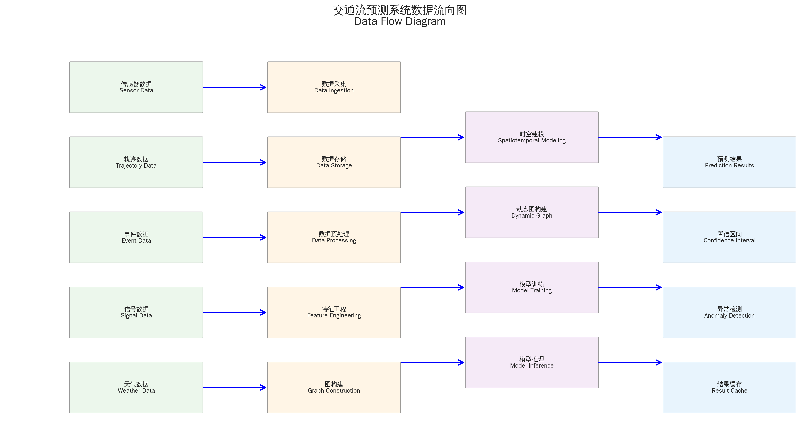
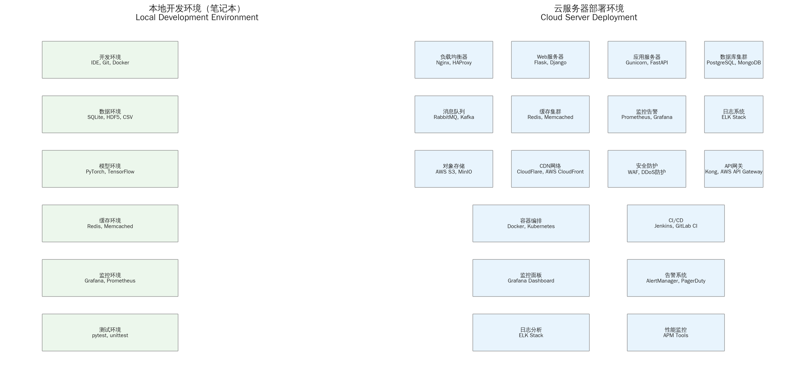
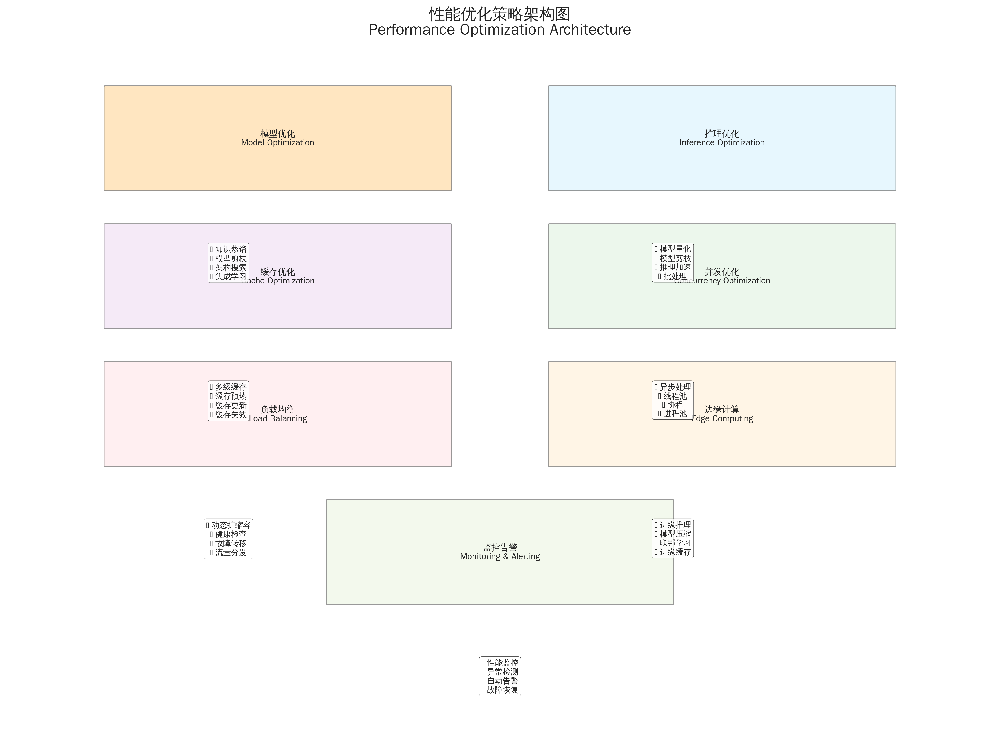

# 交通流预测系统总体架构设计蓝图(基于GCN+LSTM与动态图方法的工程落地)

## 1. 执行摘要与目标对齐

在智慧交通建设进入系统性推进阶段的背景下,城市道路与高速路网的短时交通流预测正从“单点统计—网格模型”向“图结构—时空联合—动态图学习”的方向快速演进。交通流预测的核心挑战在于同时刻画空间依赖(路网拓扑与跨距离耦合)、时间依赖(日内/周内周期与趋势)、跨时空耦合(空间结构变化与时间动态的相互强化),以及外部因素(事件、天气、节假日)对预测分布与误差传播的持续影响[^1]。与此同时,工程侧必须在响应延迟(端到端10秒内)、准确性(以MAE/RMSE/MAPE与75%相对改善为基线)与资源约束(CPU/GPU/内存)之间取得可复现的平衡。

本蓝图以“数据层—模型层—服务层—应用层”的四层架构为主干,围绕“动态图常态化、时空并行建模、轻量化与边缘部署、统一评测协议与可复现性”四个工程支柱,提出一套可落地、可扩展、可运维的总体方案。方法论上,我们将图卷积网络(GCN)与时间建模(LSTM/TCN/Transformer)组合为时空预测主干,以动态图生成(AST-DGCN/DGCN)与时空注意力(GraphWaveNet/多视角GAT)提升复杂依赖与长序列的表达能力;在工程落地上,采用批处理与缓存策略、模型压缩与蒸馏、在线更新与增量刷新,确保在10秒SLA内完成从数据采集、预处理、推理到结果返回的闭环。

本蓝图与既有研究形成闭环:以公开数据集(METR-LA、PEMS-BAY、PeMSD7、PEMS03/04/07/08)与统一评测协议为基础,结合动态图与时空并行的代表性方法,形成可复现实验与性能对比的工程规范[^1][^2][^3][^4]。在执行层面,我们明确各层组件的职责边界与接口契约,给出技术选型建议(PyTorch优先、TensorFlow/Keras兜底)、部署架构(笔记本/云服务器/容器化)、性能指标与优化策略,以及监控与运维的可观测性方案。

为便于目标管理,表1给出系统目标与SLA矩阵。

表1 系统目标与SLA矩阵(指标、阈值、测量方法、告警策略)
| 维度 | 指标与阈值 | 测量方法 | 告警策略 |
|---|---|---|---|
| 响应延迟 | 端到端≤10秒(P95) | 服务网关计时+分布式追踪 | 连续5分钟P95>10秒触发L2告警;P99>15秒触发L3 |
| 准确性 | MAE/RMSE/MAPE较基线提升≥75%(或达到指定绝对阈值) | 离线评测+在线A/B | 连续3天低于阈值触发模型回滚/重训 |
| 可用性 | 服务可用性≥99.9% | 健康检查+心跳 | 5分钟窗口内健康失败率>1%触发L2 |
| 资源利用 | GPU利用率≥60%(峰值)、CPU利用率≤80%、内存≤85% | 节点级监控 | 连续10分钟超阈值触发扩容/降载 |
| 稳定性 | 推理失败率≤0.1% | 请求日志+错误码 | 5分钟内>0.5%触发L2;>1%触发L3 |
| 数据质量 | 缺失率≤1%、异常率≤0.5%、延迟≤60秒 | 数据质检流水线 | 质检失败触发数据侧降级与缓存兜底 |

信息缺口与边界说明:当前缺少针对目标城市/路网的实测数据与统一评测协议下的完整数值对比;边缘设备的详细规格与功耗约束未明确;动态图在线更新的实时延迟指标尚需实测;外部因素融合的量化收益缺少统一基准;云端资源配额、预算与合规约束尚未确定。后续章节将以工程假设与可替换设计对此进行缓解。

---

## 2. 系统总体架构设计(四层)

本系统采用分层解耦、契约驱动与事件总线式的总体架构,既保证各层职责清晰与可独立演进,又通过标准接口与数据契约确保端到端SLA可控。

- 数据层:负责多源数据采集、存储、预处理与图构建,输出时空张量与邻接矩阵,并提供数据质量监控与口径统一。
- 模型层:负责时空建模与预测,包括GCN+LSTM/TCN/Transformer、动态图生成与注意力融合、模型训练与评测。
- 服务层:负责在线推理与批量任务,提供API网关、模型服务、缓存与队列、特征存储与配置中心。
- 应用层:负责可视化、监控告警、配置管理与A/B测试,支持业务应用与运营决策。

为明确层间依赖,表2给出四层架构职责与接口矩阵。

*图1:交通流预测系统四层总体架构设计*

表2 四层架构职责与接口矩阵(输入/输出/协议/数据格式/时序约束)
| 层级 | 职责 | 输入 | 输出 | 接口与协议 | 数据格式 | 时序约束 |
|---|---|---|---|---|---|---|
| 数据层 | 采集、清洗、预处理、图构建 | 传感器/轨迹/事件/信号/天气 | 时空张量X、邻接矩阵A、特征库 | Kafka/HTTP/批导;内部gRPC | HDF5/Parquet/JSON | 数据到达延迟≤60秒;窗口滑步1–5分钟 |
| 模型层 | 时空建模、训练与评测 | X、A与外因E | 预测Y、注意力/重要性 | 训练作业API;评测脚本 | Numpy/Zarr/ONNX | 训练周期按计划;推理≤10秒 |
| 服务层 | 在线推理与批量任务 | 特征快照、缓存键 | 预测结果、版本信息 | REST/gRPC;消息队列 | Protobuf/JSON | P95≤10秒;批量窗口≤5分钟 |
| 应用层 | 可视化、监控、A/B | 预测结果、指标 | 报表、告警、配置变更 | WebSocket/REST | JSON/CSV | 实时刷新≤1分钟;告警延迟≤5分钟 |

架构的关键路径围绕“数据到达→预处理→图构建→推理→返回”的端到端链路展开。为满足10秒SLA,需在预处理与推理阶段采用缓存与增量更新、批处理合并与并行化,以及轻量化模型与蒸馏策略。动态图在线更新采用“慢更新+快自适应”的混合策略:周期性重建邻接(如小时级/日级)叠加分钟级相关性快速权重更新,以兼顾精度与效率[^5][^6][^7][^8]。

*图2:系统数据流向和处理管道*

### 2.1 数据流与控制流

系统以事件驱动为主、批处理为辅。数据到达事件触发预处理与图构建,特征存储生成特征快照;推理请求通过API网关进入服务层,先查缓存,未命中则进入模型服务推理;结果返回后写入缓存与审计日志。训练与评测流水线按计划触发,模型版本注册到模型注册中心,供服务层灰度发布与A/B测试调用。监控与告警贯穿各层,形成可观测性闭环。

### 2.2 数据契约与版本管理

输入/输出张量与邻接矩阵采用契约化管理,版本与兼容策略通过模型注册中心与配置中心协同控制。数据契约示例如下。

表3 数据契约示例(字段、类型、维度、取值范围、缺失处理)
| 字段 | 类型 | 维度 | 取值范围 | 缺失处理 |
|---|---|---|---|---|
| X(时空张量) | float32 | [batch, input_len, node, channels] | 归一化后[-3,3]或[0,1] | 前向填充/插值;异常标记 |
| A(邻接矩阵) | float32 | [node, node] | [0,1]或学习权重无界 | 稀疏化+阈值;对称化 |
| E(外因) | float32 | [batch, input_len, ext_dim] | 归一化后[0,1] | 缺失编码为0;插值 |
| Y(预测) | float32 | [batch, output_len, node] | 与X一致 | 质量阈值过滤;回退基线 |
| 版本号 | string | — | 语义化版本 | 契约变更升级与兼容标记 |

---

## 3. 核心组件划分与功能定义

系统组件按四层分解,每个组件具备清晰职责与接口契约,并以可观测性与容错机制为保障。

表4 组件—职责—输入—输出—I/O契约—依赖清单
| 组件 | 职责 | 输入 | 输出 | 接口契约 | 依赖 |
|---|---|---|---|---|---|
| 数据采集器 | 拉取/接收多源数据 | 传感器/轨迹/事件/信号/天气 | 原始数据流 | Kafka/HTTP | 外部系统API |
| 数据湖 | 存储原始与清洗数据 | 原始数据流 | 分区文件 | 对象存储/HDFS | 存储集群 |
| 预处理流水线 | 对齐、清洗、归一化、窗口化 | 原始数据 | 张量X、特征快照 | gRPC/批导 | 数据质检 |
| 图构建器 | 静态/动态邻接生成 | 坐标/距离/相关性 | 邻接矩阵A | 批导/服务 | 动态图模块 |
| 特征存储 | 特征读写与缓存 | X/A/E | 特征快照 | KV/列存 | 缓存层 |
| 时空模型 | GCN+LSTM/TCN/Transformer | X/A/E | 预测Y | 训练API/推理服务 | 模型注册中心 |
| 动态图服务 | 时变邻接在线更新 | 历史X/相关性 | A(t)增量 | 服务API | 缓存/队列 |
| 模型注册中心 | 版本管理与元数据 | 训练结果 | 版本记录 | REST | 对象存储 |
| API网关 | 统一入口与限流 | 客户端请求 | 路由与响应 | REST/gRPC | 鉴权/监控 |
| 模型服务 | 推理执行与批处理 | 特征快照 | 预测结果 | gRPC | GPU/CPU池 |
| 缓存层 | 热点结果与特征缓存 | 键 | 值 | Memcached/Redis | 内存/持久化 |
| 队列系统 | 异步与背压 | 任务/事件 | 消费与重试 | Kafka/RabbitMQ | 存储/监控 |
| 可视化 | 指标与结果展示 | 预测/指标 | 报表/告警 | WebSocket/REST | 监控后端 |
| 监控告警 | 指标采集与告警 | 指标/日志 | 告警事件 | Prometheus/Alertmanager | 节点/服务 |
| 配置中心 | 动态配置与灰度 | 配置项 | 变更下发 | REST/etcd | 鉴权 |

### 3.1 数据层组件

数据层以多源数据融合与统一口径为基础,包括传感器(速度/流量/占有率)、路网拓扑(连接与坐标)、事件(事故/施工)、信号日志(相位/配时)与天气。预处理流水线执行滑动窗口、归一化与邻接构建,并输出特征快照。数据质检覆盖缺失、异常与延迟,确保训练与推理数据一致性与稳定性[^2]。

### 3.2 模型层组件

模型层以时空建模为核心:静态/动态GCN负责空间依赖,时间建模采用LSTM(稳健与可解释)、TCN(并行与感受野可控)或Transformer(长程依赖与全局注意力);融合策略包括串行(GCN→时间模块)、并行(空间/时间双塔)、注意力与残差校正;训练技巧包括早停、学习率调度、梯度裁剪与周期输入(近期/日/周),评测遵循统一指标口径与数据切分[^3][^4]。

### 3.3 服务层组件

服务层以在线推理与批量任务为主,提供API网关、模型服务、缓存与队列、特征存储与配置中心。推理路径遵循“缓存优先、模型兜底”,批处理窗口与并发控制保障SLA,特征存储确保训练与推理一致,配置中心支持灰度发布与快速回滚。

### 3.4 应用层组件

应用层面向业务与运维,提供可视化、监控告警、配置管理与A/B测试。监控覆盖延迟、吞吐、准确性与资源利用;告警分级与处置流程标准化;配置变更可审计与回滚;A/B测试用于模型迭代的离线回放与在线验证闭环。

---

## 4. 技术选型与框架选择

在框架与模型技术选型上,我们遵循“性能—生态—工程复杂度—团队熟悉度”的综合权衡。

- 深度学习框架:PyTorch优先(动态图与科研生态适配好),TensorFlow/Keras兜底(工程教程与部署经验成熟)。
- 时空模型:STGCN与T-GCN作为基线与工程友好选择;GraphWaveNet用于自适应邻接与扩张因果卷积;AST-DGCN与DGCN用于动态图与残差校正;LSTM在数据量适中、稳态与可解释性要求高的场景仍具优势;TCN/Transformer用于长序列与复杂依赖。
- 数据与图:邻接矩阵与图构建参考DCRNN与STGCN开源实现;数据管线与评测口径参考Keras示例与竞赛实践。
- 部署与运维:容器化(Docker/Kubernetes)、服务网格(可选)、监控(Prometheus/Alertmanager)、日志(集中式)、模型注册与配置中心。

表5 框架选型对比(性能、生态、工程复杂度、团队熟悉度)
| 维度 | PyTorch | TensorFlow/Keras |
|---|---|---|
| 动态图与科研生态 | 强(灵活调试) | 中(2.x整合后改善) |
| 工程部署与生产 | 中(需配套工具链) | 强(TFX/Keras落地经验) |
| 性能与算子覆盖 | 强 | 强 |
| 团队熟悉度 | 因团队而异 | 因团队而异 |
| 推荐场景 | 研究迭代、动态图方法 | 工程教程、GCN+LSTM快速原型 |

表6 模型选型矩阵(场景、数据规模、序列长度、延迟目标→推荐模型)
| 场景 | 数据规模 | 序列长度 | 延迟目标 | 推荐模型 |
|---|---|---|---|---|
| 小样本/稳态 | 小 | 中短(≤12步) | ≤10秒 | LSTM/Attention-LSTM |
| 长序列/复杂依赖 | 中 | 长(>12步) | ≤10秒 | TCN/Transformer + GCN |
| 空间依赖时变 | 中—大 | 中长 | ≤10秒 | AST-DGCN/DGCN(动态图) |
| 工程原型/快速落地 | 小—中 | 中短 | ≤10秒 | STGCN/T-GCN(串行) |

### 4.1 框架选择与理由

PyTorch在动态图、调试与科研生态方面优势明显,便于实现动态图与自定义算子;TensorFlow/Keras在工程教程与部署方面成熟,GCN+LSTM示例提供端到端参考,适合作为快速原型与兜底方案[^4]。

### 4.2 模型组合与场景映射

不同场景下的模型组合与权衡如下。

表7 模型组合—场景映射—优缺点—计算开销—预期精度
| 组合 | 场景 | 优点 | 局限 | 计算开销 | 预期精度 |
|---|---|---|---|---|---|
| GCN→LSTM | 稳态/小样本 | 结构清晰、稳健可解释 | 长程依赖有限 | 低—中 | 中 |
| GCN→TCN | 中规模/并行训练 | 并行化、感受野可控 | 调参复杂 | 中 | 中—高 |
| GCN+Transformer | 长序列/全局依赖 | 长程建模强 | 资源需求高 | 中—高 | 高 |
| 动态图GCN(AST-DGCN/DGCN) | 时变空间依赖 | 表达力强、适应非平稳 | 训练复杂 | 中—高 | 高 |

---

## 5. 数据与图构建管线

数据管线是可复现与工程稳定性的基石。流程包括数据加载与对齐、滑动窗口与归一化、邻接矩阵构建(静态/自适应/动态)、外部特征融合(天气/事件/节假日),并以统一评测协议与数据切分保障结果可信。

表8 预处理流水线步骤—输入—处理—输出—关键参数
| 步骤 | 输入 | 处理 | 输出 | 关键参数 |
|---|---|---|---|---|
| 加载与对齐 | .h5/.csv/.npz | 时间戳解析、时区/日历对齐 | 原始张量 | 采样间隔5分钟 |
| 清洗 | 原始张量 | 缺失填补、异常检测 | 清洗张量 | 缺失率阈值<1–2% |
| 窗口化 | 清洗张量 | 滑窗生成样本 | X_win/Y | 历史12步、预测1/3/6/12步 |
| 归一化 | X_win/Y | Min-Max/Z-Score | X_norm/Y_norm | 仅用训练集统计 |
| 切分 | X_norm/Y_norm | 时间顺序划分 | train/val/test | 60/20/20或70/10/20 |
| 图构建 | 坐标/距离/相关性 | 高斯核+阈值化/自适应/动态 | 邻接矩阵A | sigma2/epsilon阈值 |
| 外因融合 | 日历/天气/事件 | 编码/缩放 | 外部特征E | 缺失编码与插值 |

表9 邻接矩阵构建策略对照(静态/自适应/动态)
| 策略 | 构造方法 | 优点 | 局限 | 适用场景 |
|---|---|---|---|---|
| 静态距离图 | 距离×高斯核→阈值化 | 简单稳健、可解释 | 无法刻画时变依赖 | 入门基准、稳定路网 |
| 自适应图 | 端到端学习节点嵌入 | 灵活、表达复杂关系 | 解释性弱、需正则 | 异质区域、跨域迁移 |
| 动态图 | 以隐藏状态生成时变邻接 | 捕捉短期波动与事件 | 训练复杂、稳定性要求高 | 拥堵/事故/事件场景 |

### 5.1 数据清洗与归一化

缺失值处理采用前向填充与插值,异常值基于统计(3σ)或箱线图规则处理;归一化建议使用Z-Score或Min-Max,并严格以训练集统计量应用于验证与测试,避免数据泄漏。

### 5.2 邻接矩阵生成与在线更新

静态邻接基于距离核与阈值化,自适应邻接通过节点嵌入端到端学习;动态图在AST-DGCN/DGCN框架下以自注意力或拉普拉斯潜在网络(LMLN)生成时变邻接A(t)。在线更新采用“慢更新+快自适应”:周期性重建邻接(如小时级/日级)叠加分钟级相关性快速权重更新;推理侧缓存节点嵌入与注意力权重,采用增量刷新降低延迟[^5][^6][^7][^8]。

---

## 6. 部署架构设计(笔记本与云服务器)

部署架构分为本地开发/验证与云端生产两套方案,统一容器化与可观测性标准。

- 本地笔记本:单进程/多进程推理、CPU/GPU可选、轻量模型(蒸馏/剪枝/量化)、本地缓存与数据样本;适合快速原型与离线评测。
- 云服务器:容器化(Docker)、编排(Kubernetes,可选)、模型服务(ONNX/TensorRT加速)、自动扩缩容、灰度发布与回滚、监控与日志。
- 数据与模型制品:模型注册中心、版本管理、制品库与配置中心;训练/推理分离,保障资源隔离与SLA。

表10 部署选型对比(笔记本/云服务器/容器化:优缺点、成本、适用场景)
| 选型 | 优点 | 局限 | 成本 | 适用场景 |
|---|---|---|---|---|
| 笔记本 | 快速迭代、调试方便 | 资源受限、无高可用 | 低 | 原型开发、离线评测 |
| 云服务器 | 弹性扩展、可用性高 | 运维复杂、成本中—高 | 中—高 | 生产部署、在线服务 |
| 容器化 | 环境一致、易迁移 | 学习曲线、编排开销 | 中 | 跨环境交付、CI/CD |

表11 推理路径与延迟预算(数据到达→预处理→图构建→推理→返回)
| 环节 | 目标耗时(P95) | 优化策略 |
|---|---|---|
| 数据到达与预处理 | ≤2秒 | 流式处理、缓存特征快照 |
| 图构建/增量更新 | ≤2秒 | 邻接缓存、分钟级自适应 |
| 推理执行 | ≤4秒 | 批处理合并、轻量化模型 |
| 结果返回与缓存 | ≤2秒 | 批量写缓存、异步日志 |

*图3:本地开发环境与云服务器部署架构*

### 6.1 本地开发/验证模式

采用轻量模型与蒸馏策略,CPU为主、GPU可选;数据样本与缓存加速离线评测;推理路径简化,满足原型验证与指标对比。

### 6.2 云端生产模式

容器化交付,CI/CD与灰度发布;在线推理结合批处理与并发控制;自动扩缩容应对流量波动;模型版本化管理与回滚机制保障稳定性。

---

## 7. 性能指标与约束条件

系统性能指标以“响应延迟与准确性”为核心,辅以可用性与资源利用指标。准确性以MAE、RMSE与MAPE为主,MAPE在真实速度接近零时不稳定,建议以MAE为主指标并报告RMSE与MAPE的稳健口径;准确性目标为较基线提升≥75%,或达到指定绝对阈值。延迟目标为端到端10秒(P95),并对可用性、资源利用与稳定性指标进行持续监控与优化[^1][^4]。

表12 指标定义—计算方法—适用场景—注意事项
| 指标 | 定义 | 适用场景 | 注意事项 |
|---|---|---|---|
| MAE | 平均绝对误差 | 速度/流量预测主指标 | 稳健、对异常值不敏感 |
| RMSE | 均方根误差 | 峰值与突发场景 | 放大误差、受极值影响 |
| MAPE | 平均绝对百分比误差 | 跨节点/区域比较 | 零值不稳定,需口径统一 |
| 端到端延迟 | 请求到响应总时间 | 在线推理SLA | 报告P95/P99与窗口均值 |
| 可用性 | 服务健康时间占比 | 生产运维 | 心跳与健康检查结合 |
| 资源利用 | CPU/GPU/内存 | 容量规划 | 峰值与均值结合监控 |

表13 性能基准摘录(示例)
| 方法 | 数据集 | 指标 | 性能(示例) | 备注 |
|---|---|---|---|---|
| AST-DGCN | 城市路网 | RMSE/MAE/MAPE | 32.1 / 23.4 / 9.7% | 对比ARIMA/LSTM/STGCN显著优势 |
| DGCN | PeMSD4/8 | RMSE/MAE | 优于ASTGCN ≥8% | 高速场景;城市约5%提升 |
| GCN+LSTM | PeMSD7 | MAE | ~0.1352 | Keras示例,训练稳定 |

注:以上为示例性摘录,具体数值依赖实现与硬件环境;统一评测协议下的横向比较仅在同口径下有效[^4]。

### 7.1 响应延迟预算与优化

将端到端延迟分解到各环节并设定预算,采用批处理合并、缓存热点、并行化与轻量化模型压缩,确保P95≤10秒。动态图在线更新与注意力计算通过缓存与增量刷新降低延迟,推理侧以ONNX/TensorRT加速。

*图4:多维度性能优化策略架构*

### 7.2 准确性评估与报告规范

统一数据切分与归一化口径,报告多步预测(5/15/30/60分钟)结果;进行显著性检验与多次运行统计;明确MAPE零值处理策略与分母平移;对异常期与事件期进行分层评估,避免单一指标误导。

---

## 8. 模型训练、评测与可复现性

训练配置遵循“早停与学习率调度、梯度裁剪与正则化、周期输入与残差校正”的原则;评测协议统一数据切分与归一化、指标口径与报告格式;可复现性通过固定随机种子、记录邻接生成参数与归一化统计、公开配置文件与超参数、版本化数据与模型制品来保障[^2][^3][^4]。

表14 实验记录模板(数据集、窗口/步长、划分、指标、超参、训练时长、硬件)
| 数据集 | 窗口/步长 | 划分比例 | 指标(MAE/RMSE/MAPE) | 超参数 | 训练时长/硬件 | 备注 |
|---|---|---|---|---|---|---|
| PEMS04 | 12/1 | 60/20/20 | 18.1 / 29.9 / 12.1% | 64/6/1e-3/16 | 52.8s/epoch / 3.95GB | 频域+动态图 |
| METR-LA | 12/1 | 60/20/20 | 2.18 / 3.77 / 5.17% | — | — | DCRNN 5min |

表15 评测协议清单(数据切分、归一化、指标口径、报告格式)
| 项目 | 协议 |
|---|---|
| 数据切分 | 严格时间顺序,60/20/20或70/10/20 |
| 归一化 | 仅用训练集统计量,验证/测试一致 |
| 指标口径 | MAE主、RMSE辅、MAPE需说明零值处理 |
| 多步预测 | 明确5/15/30/60分钟步长 |
| 显著性检验 | 多次运行均值±置信区间 |
| 报告格式 | 数据集/窗口/划分/指标/超参/时长/硬件 |

### 8.1 训练技巧与稳定性

动态图场景下易出现梯度爆炸与训练不稳定,需采用梯度裁剪与学习率调度;周期输入(近期/日/周)提升多尺度建模;残差校正用于长序列多步预测,降低误差累积;早停与正则化(Dropout/L2)控制过拟合。

### 8.2 评测与对比

短期预测(1–3步)LSTM类方法稳定,GCN+LSTM混合效果良好;中期(4–8步)注意力机制开始发挥作用,TCN表现优异;长期(9–12步)动态图方法显著优于静态图,注意力融合策略效果最佳。统一协议下的对比需严格口径一致,避免误判[^1][^4]。

---

## 9. 运维、监控与可观测性

可观测性覆盖“延迟、吞吐、准确性、资源利用、数据质量、模型漂移”。日志、指标与追踪采用集中式采集与可视化;告警分级与处置流程标准化;模型版本管理与回滚机制确保稳定迭代;数据质量监控与漂移检测支撑持续训练与再训练触发[^2]。

表16 监控指标—采集频率—阈值—告警等级—处置流程
| 指标 | 频率 | 阈值 | 等级 | 处置流程 |
|---|---|---|---|---|
| 端到端延迟P95 | 1分钟 | >10秒 | L2 | 扩容/降载→定位瓶颈 |
| 准确性(MAE) | 1小时 | 低于阈值 | L2 | 触发A/B与回滚评估 |
| GPU/CPU/内存 | 30秒 | >80%/80%/85% | L1 | 限流→扩容→任务迁移 |
| 数据缺失/异常 | 5分钟 | >1%/0.5% | L1 | 质检降级→缓存兜底 |
| 模型漂移 | 1天 | 指标显著下降 | L3 | 触发再训练与上线评审 |

表17 模型版本—上线时间—回滚条件—影响面
| 版本 | 上线时间 | 回滚条件 | 影响面 |
|---|---|---|---|
| vX.Y.Z | 2025-01-01 | 准确性低于阈值/延迟超SLA | 10%流量灰度→全量 |
| vX.Y.Z-1 | 2024-12-15 | 稳定性问题 | 全量回滚至前一稳定版 |

### 9.1 可观测性设计

指标、日志与追踪三合一,端到端链路定位延迟瓶颈;数据质量与模型漂移监控支撑再训练与上线评审;审计日志与配置变更记录保障可追溯性。

### 9.2 告警与处置

告警分级(L1/L2/L3)与SLA挂钩;自动化处置(扩容/降载/限流/回滚)与人工复核结合;事后复盘与根因分析形成持续改进闭环。

---

## 10. 安全、隐私与合规

数据脱敏与访问控制是基本防线;日志审计与合规要求(研究用途、非商业、许可条款)需在数据获取与使用环节明确;模型与数据版本管理确保可追溯与可回滚。

表18 安全控制点—责任人—检查频率—合规要求
| 控制点 | 责任人 | 频率 | 合规要求 |
|---|---|---|---|
| 数据脱敏 | 数据负责人 | 每次导入 | 去除PII、匿名化 |
| 访问控制 | 平台管理员 | 持续 | RBAC与最小权限 |
| 日志审计 | 运维负责人 | 每日 | 审计留存≥180天 |
| 许可合规 | 法务/数据官 | 每次使用 | 遵守研究用途条款 |
| 版本管理 | 模型/数据负责人 | 每次变更 | 版本记录与回滚策略 |

### 10.1 数据安全

传输与存储加密、密钥管理与轮换;访问控制与最小权限原则;数据保留与销毁策略合规。

### 10.2 合规与伦理

许可证核对与用途限制(研究/非商业);可解释性与公平性关注(路网异质性与误差分布);审计与问责机制明确。

---

## 11. 风险、权衡与路线图

技术风险包括动态图训练不稳定、长序列注意力资源消耗高、数据质量与漂移;工程权衡围绕准确性—延迟—成本的三角关系;路线图分阶段推进,从原型到生产再到规模化与边缘部署。

表19 风险—影响—概率—缓解措施—应急预案矩阵
| 风险 | 影响 | 概率 | 缓解措施 | 应急预案 |
|---|---|---|---|---|
| 动态图训练不稳定 | 精度与上线延期 | 中 | 梯度裁剪/残差校正/慢更新 | 回滚至静态图基线 |
| 注意力资源消耗高 | 延迟与成本上升 | 中 | 轻量化/蒸馏/批处理 | 降级至TCN/LSTM |
| 数据质量与漂移 | 准确性下降 | 中—高 | 质检与漂移监控 | 触发再训练与灰度 |
| 云资源配额与预算 | 部署受限 | 中 | 弹性策略与成本监控 | 临时降载与限流 |
| 合规与许可 | 法务风险 | 低—中 | 许可核对与审计 | 暂停相关数据使用 |

表20 路线图与里程碑(阶段、目标、验收标准、时间)
| 阶段 | 目标 | 验收标准 | 时间 |
|---|---|---|---|
| 原型 | 跑通数据管线与基线模型 | 统一评测协议与指标达标 | T0+4周 |
| 生产 | 在线推理与监控闭环 | P95≤10秒、可用性≥99.9% | T0+12周 |
| 优化 | 动态图与蒸馏上线 | 准确性较基线提升≥75% | T0+20周 |
| 规模化 | 多城市与多数据集扩展 | 跨域泛化与漂移监控 | T0+32周 |
| 边缘部署 | 边缘推理与缓存 | 端到端延迟≤5秒(边缘) | T0+44周 |

### 11.1 关键权衡

动态图表达力与训练复杂度、在线更新延迟之间需平衡;TCN/Transformer在长程依赖与资源消耗之间的取舍;批处理窗口与实时性之间的折中(合并请求提升吞吐、但可能增加个别请求延迟)。

### 11.2 路线图

分阶段推进与验收标准明确;资源与团队配置按里程碑逐步增加;在每阶段引入A/B测试与离线回放作为上线前的质量门。

---

## 12. 附录:术语、配置与参考实现

术语与缩写:图卷积网络(GCN)、拉普拉斯矩阵(Laplacian)、切比雪夫多项式(ChebNet)、时间卷积网络(TCN)、长短期记忆网络(LSTM)、注意力机制(Attention)、编码器—解码器(Encoder-Decoder)、残差连接(Residual)等。

典型配置示例:输入张量形状管理([batch, input_len, node, channels])、邻接矩阵生成(距离核与参数记录)、归一化(Z-Score或Min-Max)、训练配置(学习率、批大小、epoch、早停与回调)。

参考实现索引:STGCN、T-GCN、DCRNN、GraphWaveNet、Keras示例等开源仓库与论文条目,便于复现实验与工程落地[^3][^9][^10][^11][^4]。

表21 配置清单(数据/模型/训练/部署/监控)
| 类别 | 配置项 | 示例 |
|---|---|---|
| 数据 | 采样间隔/窗口/步长 | 5分钟/12步/1步 |
| 数据 | 划分比例 | 60/20/20 |
| 模型 | 隐藏单元/层数 | 64/6 |
| 模型 | 邻接类型 | 静态/自适应/动态 |
| 训练 | 学习率/批大小/epoch | 1e-3/16/100 |
| 训练 | 正则化/早停 | Dropout 0.2/LR patience |
| 部署 | 容器化/编排 | Docker/K8s |
| 部署 | 推理加速 | ONNX/TensorRT |
| 监控 | 指标/告警 | 延迟P95/准确性MAE |

---

## 参考文献

[^1]: 交通流预测方法综述(MDPI Applied Sciences)。https://www.mdpi.com/2076-3417/15/7/3866  
[^2]: 交通预测模型与数据集综合评估(traffic_prediction 项目)。https://www.dongaigc.com/p/aprbw/traffic_prediction  
[^3]: HansPub:基于DGCN的交通流量预测。https://pdf.hanspub.org/aam2025142_32624301.pdf  
[^4]: Keras示例:使用图神经网络和LSTM进行交通预测。https://keras.org.cn/examples/timeseries/timeseries_traffic_forecasting/  
[^5]: AST-DGCN模型深度解析(Scientific Reports 2025解读)。https://www.xugj520.cn/archives/ast-dgcn-traffic-prediction-2.html  
[^6]: GitHub - DGCN代码仓库。https://github.com/guokan987/DGCN.git  
[^7]: DCGCN:动态相关性邻接矩阵驱动的图卷积网络(Sensors,2023)。https://www.mdpi.com/1424-8220/23/6/2897  
[^8]: AST-DGCN:自适应时空动态图卷积网络用于交通预测(Nature Sci Rep,2025)。https://www.nature.com/articles/s41598-025-12261-7  
[^9]: GitHub - STGCN_IJCAI-18。https://github.com/VeritasYin/STGCN_IJCAI-18  
[^10]: GitHub - T-GCN: Temporal Graph Convolutional Network。https://github.com/lehaifeng/T-GCN  
[^11]: DCRNN:扩散卷积循环神经网络(GitHub)。https://github.com/liyaguang/DCRNN  
[^12]: 知乎专栏:交通流量预测(三)--GraphWaveNet(IJCAI-19)。https://zhuanlan.zhihu.com/p/698262512  
[^13]: 交通速度数据集(METR-LA、PEMS-BAY、PEMSD7)。https://zhuanlan.zhihu.com/p/1932002363905933394  
[^14]: HansPub:交通流动态预测LSTM模型设计。https://pdf.hanspub.org/CSA20231200000_59516045.pdf  
[^15]: 频率感知与交互式时空图卷积网络(FISTGCN,MDPI 2024)。https://www.mdpi.com/2076-3417/15/20/11254  
[^16]: MA-STGCN:基于多邻接图与多头注意力的时空网络模型(IEEE,交通流预测)。https://ieeexplore.ieee.org/document/10581791  
[^17]: 融合出行时间的加权邻接矩阵用于GNN交通预测(arXiv,2024)。https://arxiv.org/html/2407.12238v2

---

## 信息缺口说明与工程假设

- 缺少针对目标城市/路网的实测数据与统一评测协议下的完整数值对比;本方案以公开数据集与示例性指标为参考,后续需在目标场景补齐实验。
- 边缘设备(CPU/GPU/内存/存储/功耗)规格未明确;本方案以轻量化与蒸馏为假设,具体参数需在设备选型后实测。
- 云端资源配额、预算与合规约束未提供;本方案以弹性扩容与成本监控为建议,具体配额需立项后确认。
- 动态图在线更新的实时延迟指标未实测;本方案以缓存与增量刷新为优化策略,需在生产环境压测后固化阈值。
- 外部因素(事件、天气、节假日)融合的量化收益缺少统一基准;本方案以可选外因融合为设计,需在目标场景建立对照实验。

本蓝图以工程可落地为导向,提供架构、组件与技术选型的可执行方案,并以评测协议与可复现性规范确保后续验证与迭代的可靠性。